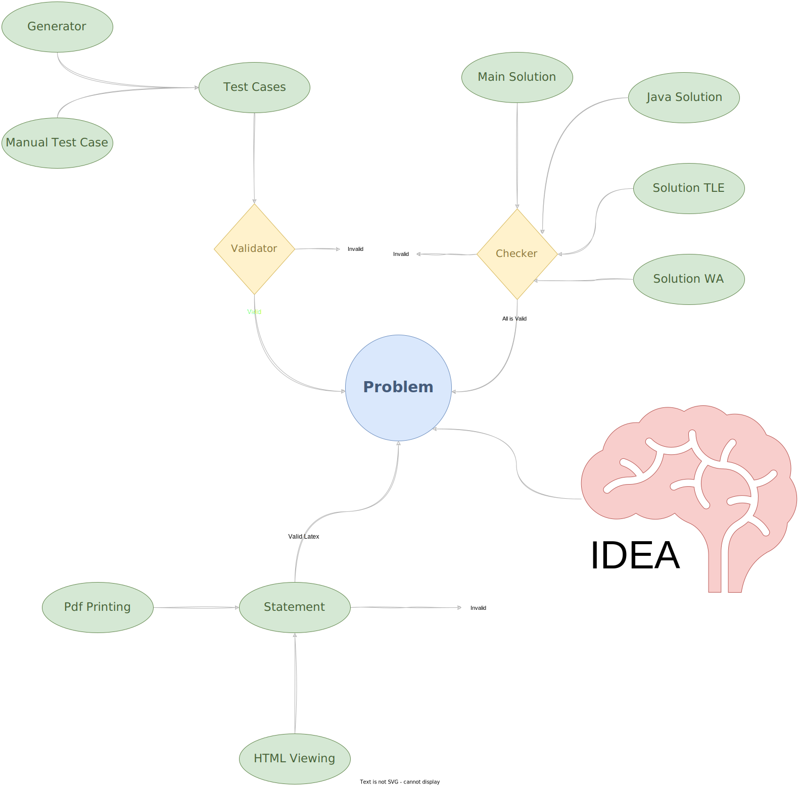
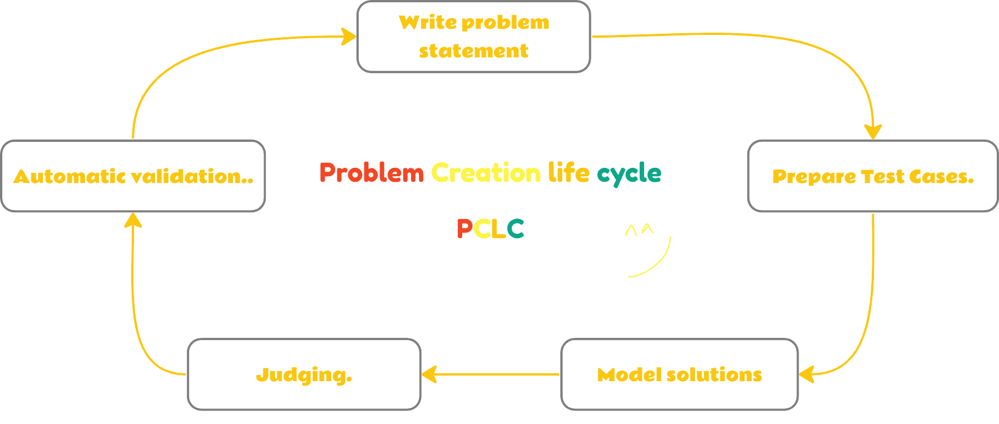

# PolygonCodeforcesContestPreparation

### Polygon-Codeforces [Link](https://polygon.codeforces.com)

---

### What we need to know before starting?

- **Generator**: Program to generate testcases for your problem and test participants solutions.
- **Validator**: Program to check all testcases is generated in correctly range from constraints.
- **Checker**: Program to check all participants solution is correctly or not.
- **Solutions**: We mean here Judge solution and main solution should be 100% correctly to be compared with another solution results.
- **Polygon-Codeforces Library**: You should install it [testlib.h](https://github.com/MikeMirzayanov/testlib).
- **Polygon-Codeforces Library Tutorial**: Check here [CF-testlib.h blogs](https://codeforces.com/testlib).

---

## Problem Creation process

[//]: # (
)

[//]: # (
Process
)

[//]: # (
)

---

## Problem Creation Life Cycle

[//]: # (
)

[//]: # (
PCLC
)

[//]: # (
)
